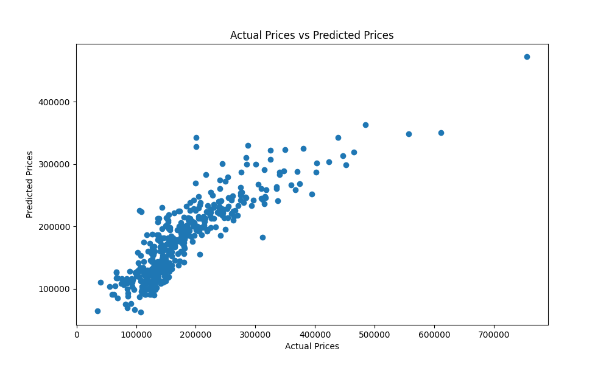

# Linear Regression Model for House Price Prediction

This linear regression model predicts the prices of houses based on their square footage and the number of bedrooms and bathrooms. It is the first of five tasks completed for Prodigy InfoTech during the Machine Learning Internship.

## Runtime Output:

### Random Data Sample After Pre-Processing
```python
   TotalBsmtSF  GrLivArea  BedroomAbvGr  FullBath  HalfBath  BsmtFullBath  BsmtHalfBath  SalePrice
        1007       1077             3         1         0             0             0      91000
         1248       1350             3         2         1             0             0     168500
          624       1344             3         2         0             1             0      98000
         1056       1063             3         1         0             0             0     128000
         1660       1660             3         2         1             0             0     290000
          915       1167             3         2         1             0             0     144000
          672        672             2         1         0             0             0     108000
         1052       1920             3         2         0             0             0     172500
          440        869             2         1         0             0             0      85500
         1120       1130             3         1         0             0             0     120000
```
### Training
```python
Index: 1022 entries, 135 to 1126
Data columns (total 7 columns):
 #   Column        Non-Null Count  Dtype
---  ------        --------------  -----
 0   TotalBsmtSF   1022 non-null   int64
 1   GrLivArea     1022 non-null   int64
 2   BedroomAbvGr  1022 non-null   int64
 3   FullBath      1022 non-null   int64
 4   HalfBath      1022 non-null   int64
 5   BsmtFullBath  1022 non-null   int64
 6   BsmtHalfBath  1022 non-null   int64
dtypes: int64(7)
```
### Predicting
```python
0    119180.001823
1    307806.712380
2    126162.544225
3    185002.419444
4    248263.165710
..             ...
433  131547.040353
434  143920.480601
435  193603.254973
436  104000.762732
437  363672.755320
```
### Evaluation Metrics
```python
R-squared: 0.732540
Mean Squared Error: 1866360931
Explained Variance Score: 0.733163
Normalized Mean Squared Error (% of Variance): 26.75%
Root Mean Squared Error (% of Standard Deviation): 51.72%
```

